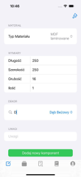
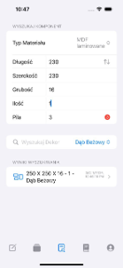
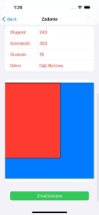
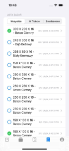

# MeblePRO - Furniture Component Management System

MeblePRO is an ERP application designed and developed to cater to the needs of small and medium-sized furniture making companies. The system focuses on efficient management and control of furniture components while offering simplicity and affordability, particularly for businesses unwilling to invest in overly complex solutions.

## Features

- **Warehouse Management**: Monitor warehouse positions to effectively manage inventory.
- **Custom Search**: Add, delete, and search furniture components based on user-defined parameters such as length, width, height, and decor.
- **User Authentication**: Log in and sign up new users with authentication features.
- **User Profile Management**: Users can edit their profile information.
- **Multi-platform Availability**: Available on iOS, Windows, and as a web application.

## Technologies Used

- Developed using Swift and SwiftUI.
- Utilizes Firebase for real-time database management and authentication.

## Installation

1. Clone the repository.
2. Open the iOS project in Xcode.
3. Set up Firebase project and add Firebase configuration files to the project.
4. Run the project on an iOS simulator or physical device.

## Aplication Views
    

    
